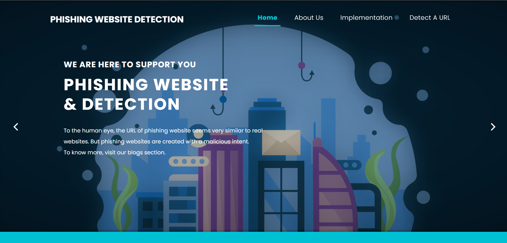

**Phishing Website Detection System**

**📌 Project Overview**
Phishing websites are designed to steal sensitive user information such as passwords, banking details, and personal data by mimicking legitimate websites. Traditional detection methods often struggle to identify newly created phishing websites.

This project presents a Machine Learning-based Phishing Website Detection System that analyzes URL characteristics and predicts whether a website is legitimate or phishing in real time through a web application.

**🚨 Problem Statement**
Cybercriminals create fraudulent websites that appear identical to trusted websites. Users often find it difficult to distinguish between genuine and phishing websites, resulting in:

Identity theft
Financial fraud
Data breaches
Unauthorized account access
A reliable automated detection system is needed to help users identify malicious websites before interacting with them.

**🛠️ Tech Stack**
| Technology | Purpose |

| ------------- | ------------------------------------- |

| Python | Core programming language |

| Flask | Web application framework |

| Random Forest | Machine Learning classification model |

| Pandas | Data preprocessing and analysis |

| NumPy | Numerical computations |

| Scikit-Learn | Model evaluation and preprocessing |

| HTML/CSS | User Interface |

| Pickle (.pkl) | Model serialization and deployment |

🏗️ System Architecture

📸 Application Screenshots
### Home Page

### Legitimate Website Prediction

### Phishing Website Prediction

▶️ How to Run the Project
Clone Repository
git clone https://github.com/PAVANI-MYNAM/phishing_website_detection

Navigate to Project Folder
cd phishing-website-detection

Install Dependencies
pip install -r requirements.txt

Run Application
python app.py

Open Browser
http://localhost:5000

**🔮 Future Enhancements**
Deep Learning-based phishing detection.

Browser extension integration.

Real-time URL reputation checking.

Integration with threat intelligence feeds.

API-based deployment for enterprise use.

Explainable AI (XAI) for prediction transparency.

Detection of QR-code phishing attacks.

Mobile application support.

**👩‍💻 Author**
Pavani Mynam

B.Tech – Computer Science & Engineering

Sri Venkateswara College of Engineering, Tirupati
